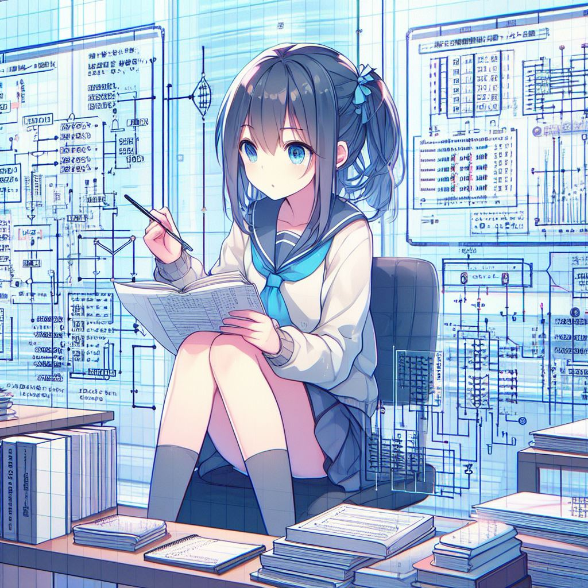

# Learn Data Structures and Algorithms with Anime Girls 🌸

Welcome to the magical world where data structures, algorithms, and anime girls come together in harmony! 🎀 

## Goal
The goal of this repository is to provide a fun and engaging platform for learning data structures and algorithms. Each topic is presented in its own directory, complete with code implementations and detailed explanations, all adorned with delightful illustrations featuring iconic anime girls. 🌟

## How to Use
1. **Explore the Directories**: Navigate through the directories to find the topic you're interested in. Each directory corresponds to a specific data structure or algorithm.

2. **Read the README.md**: Inside each directory, you'll find a README.md file that explains the topic in depth.

3. **Study the Code**: Dive into the code implementations provided in each directory. These code snippets are designed to illustrate how each data structure or algorithm works.

4. **Get Creative**: Feel free to experiment with the code, tweak it, and see how it behaves. Learning is all about exploration and discovery, so don't hesitate to get creative!

